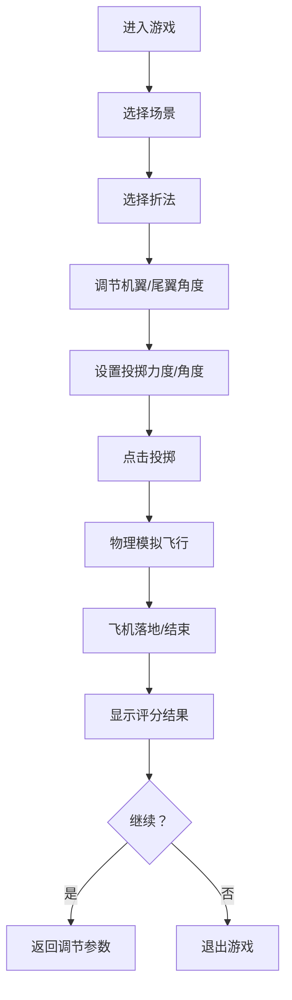

## 1. 产品概述

纸飞机飞行游戏是一款休闲模拟类网页游戏，玩家通过折叠纸飞机、调整飞行参数、投掷飞机来挑战飞行距离和滞空时间。游戏以轻松愉快的风格，还原童年折纸飞机的乐趣。

- 主要目的：让玩家体验折纸飞机、投掷飞行的趣味过程，通过参数调整优化飞行表现
- 目标用户：喜欢休闲小游戏的各年龄段用户
- 产品价值：提供轻松解压的游戏体验，结合物理模拟带来策略性玩法

## 2. 核心功能

### 2.1 功能模块

1. **场景选择页**：户外场景（草地、天空、云朵）与室内场景（房间、窗户）切换
2. **折法选择页**：多种经典纸飞机折法（飞镖式、滑翔式、特技式等），每种折法具有不同飞行特性
3. **参数调节页**：机翼角度、尾翼角度、投掷力度、投掷角度四个参数滑块
4. **飞行场景页**：Canvas 2D 物理模拟飞行，实时显示飞行状态
5. **结果评分页**：飞行距离、滞空时间、综合评分、历史最高分

### 2.3 页面详情

| 页面名称 | 模块名称 | 功能描述 |
|---------|---------|---------|
| 场景选择页 | 场景卡片 | 展示户外/室内场景预览，点击选择进入游戏 |
| 折法选择页 | 折法卡片 | 展示4种不同折法，包含名称、图标、飞行特性说明（升力、速度、稳定性） |
| 参数调节页 | 机翼角度滑块 | -30°~30°调节，影响升力系数 |
| 参数调节页 | 尾翼角度滑块 | -20°~20°调节，影响飞行稳定性 |
| 参数调节页 | 投掷力度滑块 | 0~100，决定初始速度 |
| 参数调节页 | 投掷角度滑块 | 0°~90°，决定抛射角度 |
| 参数调节页 | 3D预览区 | 实时预览纸飞机当前形态 |
| 飞行场景页 | Canvas画布 | 2D物理模拟纸飞机滑翔，包含重力、空气阻力、升力计算 |
| 飞行场景页 | HUD显示 | 实时显示当前高度、速度、距离、飞行时间 |
| 结果评分页 | 分数面板 | 显示飞行距离、滞空时间、综合得分，评级（S/A/B/C/D） |
| 结果评分页 | 排行榜 | 本地存储历史最高分记录 |

## 3. 核心流程

玩家进入游戏 → 选择场景（户外/室内） → 选择飞机折法 → 调节机翼与尾翼角度 → 设置投掷力度与角度 → 点击投掷 → 观看纸飞机物理模拟飞行 → 查看评分结果 → 重新开始或调整参数重试

## 4. 用户界面设计

### 4.1 设计风格

- **主色调**：天空蓝 `#4A90D9` 作为主色，纸白 `#F8F6F0` 为背景，橙黄 `#FFB347` 为强调色
- **辅助色**：草地绿 `#6BB35F`、云朵灰 `#E8E8E8`
- **按钮风格**：圆角胶囊形按钮，悬浮时有轻微上浮+阴影加深效果
- **字体**：标题使用圆润活泼的字体 `ZCOOL KuaiLe`，正文使用 `Noto Sans SC`
- **布局风格**：卡片式布局，柔和阴影，充足留白
- **图标风格**：线条圆润、填充饱满的扁平风格图标

### 4.2 页面设计概览

| 页面名称 | 模块名称 | UI元素 |
|---------|---------|--------|
| 场景选择页 | 场景卡片 | 大尺寸场景缩略图，hover缩放效果，选中态蓝色边框发光 |
| 折法选择页 | 折法卡片 | 4列网格布局，每张卡片含飞机SVG图示、特性雷达图、选中态 |
| 参数调节页 | 滑块区域 | 自定义滑块轨道，渐变填充，当前值气泡提示，实时联动飞机预览 |
| 参数调节页 | 飞机预览 | 3D等距视角SVG飞机，随参数实时形变 |
| 飞行场景页 | Canvas区域 | 全屏游戏画布，天空渐变+云朵+地面，视差滚动效果 |
| 飞行场景页 | HUD面板 | 左上角半透明卡片，实时数据展示 |
| 结果评分页 | 分数卡片 | 居中大卡片，带弹出动画，分数数字放大高亮，评级徽章 |

### 4.3 响应式

桌面端优先设计，适配 1280px 以上屏幕；移动端自适应布局，参数调节区改为纵向排列，飞行画布保持全屏。

### 4.4 2D场景设计指南

- **环境氛围**：户外场景用天空垂直渐变（浅蓝→深蓝），几朵白云缓慢漂浮，远处有绿色山丘轮廓；室内场景有木质地板、白色墙面、窗户透进阳光
- **光照**：户外采用明亮日光，物体投影柔和；室内采用窗边漫射光，暖色调
- **飞行运动**：
  - 纸飞机受重力（恒定向下）、升力（与速度²×升力系数成正比，垂直于速度方向）、空气阻力（与速度²成正比，与速度反向）
  - 机翼角度增大→升力系数增大，但阻力也增大，存在最佳角度
  - 尾翼角度影响俯仰力矩，过大/过小会导致飞机失速
- **后期效果**：飞行轨迹淡淡的残影线，落地时灰尘粒子效果
- **性能预算**：Canvas 60fps，单帧计算量 < 1ms
