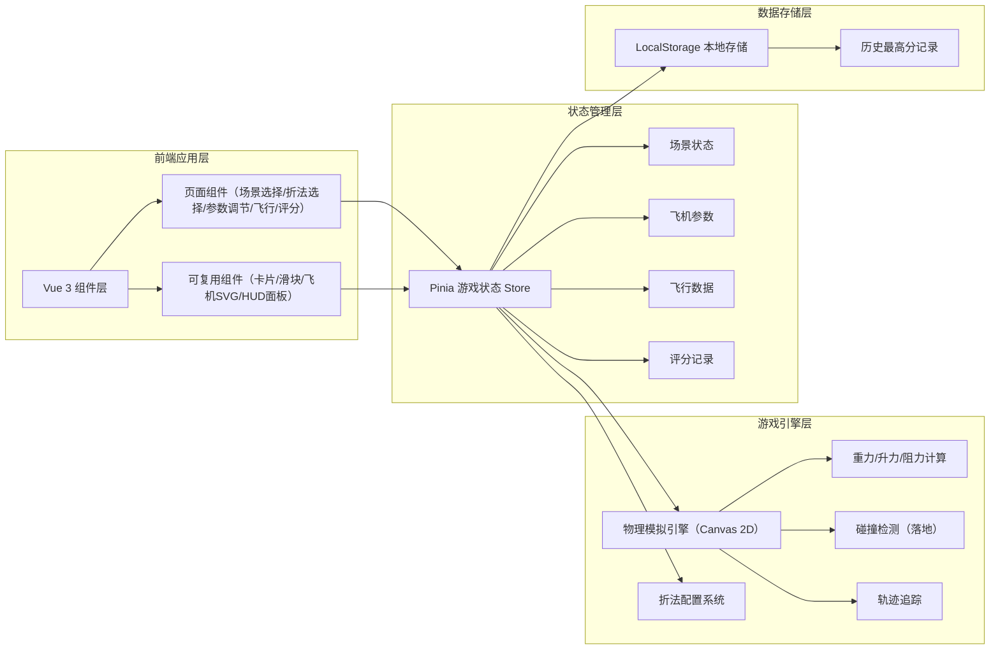
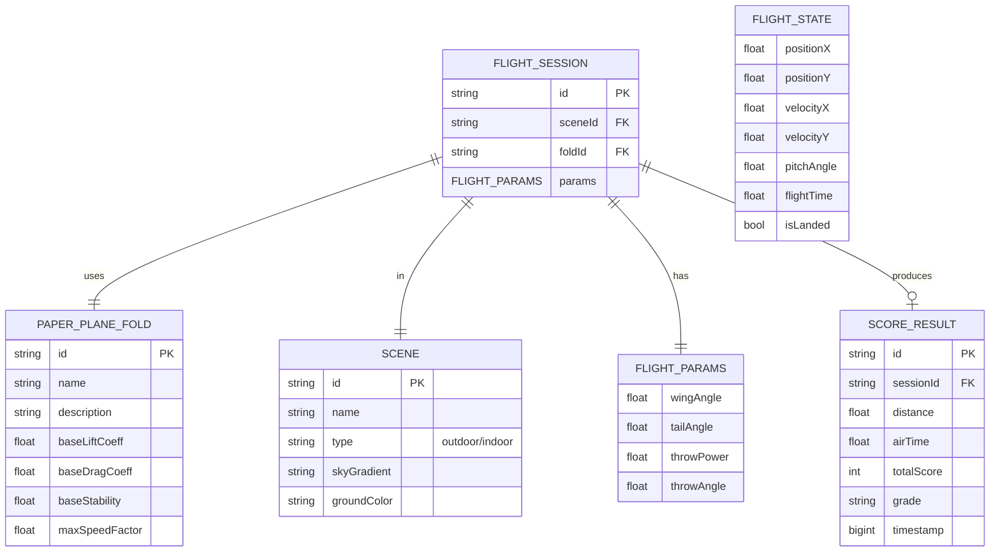

## 1. 架构设计



## 2. 技术说明

- **前端框架**：Vue 3 + Composition API + `<script setup>`
- **构建工具**：Vite 5
- **状态管理**：Pinia
- **样式方案**：原生 CSS + CSS 变量（不引入 Tailwind，减少依赖）
- **渲染方案**：HTML5 Canvas 2D API 进行游戏画面渲染
- **图标方案**：内联 SVG（无需外部图标库）
- **字体方案**：Google Fonts 引入 `ZCOOL KuaiLe`（标题）+ `Noto Sans SC`（正文）
- **数据存储**：浏览器 LocalStorage，无需后端

## 3. 路由定义

使用 Vue Router 管理页面路由：

| 路由路径 | 页面组件 | 用途 |
|---------|---------|------|
| `/` | `SceneSelect.vue` | 场景选择页（首页） |
| `/fold` | `FoldSelect.vue` | 折法选择页 |
| `/tune` | `ParameterTune.vue` | 参数调节与投掷准备页 |
| `/fly` | `FlightScene.vue` | 飞行模拟场景页 |
| `/result` | `ScoreResult.vue` | 结果评分页 |

## 4. 核心数据模型

### 4.1 折法配置（PaperPlaneFold）

| 字段名 | 类型 | 说明 |
|-------|------|------|
| id | string | 折法唯一标识 |
| name | string | 折法名称（如：经典飞镖、滑翔机） |
| description | string | 折法描述 |
| baseLiftCoeff | number | 基础升力系数（0.3~0.8） |
| baseDragCoeff | number | 基础阻力系数（0.02~0.08） |
| baseStability | number | 基础稳定性（0.5~1.2） |
| maxSpeedFactor | number | 最大速度系数（0.8~1.5） |
| svgPath | string | 飞机轮廓 SVG path 数据 |

### 4.2 飞行参数（FlightParams）

| 字段名 | 类型 | 说明 |
|-------|------|------|
| wingAngle | number | 机翼角度（度），范围 -30 ~ 30 |
| tailAngle | number | 尾翼角度（度），范围 -20 ~ 20 |
| throwPower | number | 投掷力度，范围 0 ~ 100 |
| throwAngle | number | 投掷角度（度），范围 0 ~ 90 |

### 4.3 飞行实时状态（FlightState）

| 字段名 | 类型 | 说明 |
|-------|------|------|
| positionX | number | 当前X位置（米） |
| positionY | number | 当前Y位置（米，向上为正） |
| velocityX | number | X方向速度（m/s） |
| velocityY | number | Y方向速度（m/s） |
| pitchAngle | number | 俯仰角（度） |
| flightTime | number | 已飞行时间（秒） |
| isLanded | boolean | 是否已落地 |

### 4.4 评分结果（ScoreResult）

| 字段名 | 类型 | 说明 |
|-------|------|------|
| distance | number | 飞行距离（米），保留1位小数 |
| airTime | number | 滞空时间（秒），保留2位小数 |
| totalScore | number | 综合得分（0~1000） |
| grade | string | 评级（S/A/B/C/D） |
| timestamp | number | 记录时间戳 |

### 4.5 数据模型关系图



## 5. 物理引擎核心算法

### 5.1 力的计算

```
重力：F_gravity = m * g  (恒定向下)
升力：F_lift = 0.5 * ρ * v² * S * C_L * 垂直于速度方向
阻力：F_drag = 0.5 * ρ * v² * S * C_D * 与速度反向
其中：
  C_L = baseLiftCoeff * f(wingAngle)  —— 机翼角度影响升力
  C_D = baseDragCoeff * g(wingAngle)  —— 机翼角度越大阻力越大
  f(x) = sin( (wingAngle + 15°) * π / 180° )  存在最佳升力角≈15°
```

### 5.2 俯仰力矩（尾翼影响）

```
尾翼提供俯仰力矩：M_tail = tailAngle * stability * baseStability
俯仰角速度：Δpitch = M_tail * Δt
当 |pitch| > 临界角（如45°）时触发失速：C_L 骤降、C_D 激增
```

### 5.3 积分方式

采用半隐式欧拉积分（速度先更新，再用新速度更新位置），兼顾稳定性与性能：
```
v(t+Δt) = v(t) + a(t) * Δt
x(t+Δt) = x(t) + v(t+Δt) * Δt
```

时间步长固定 Δt = 1/60 s，与画布刷新频率同步。
